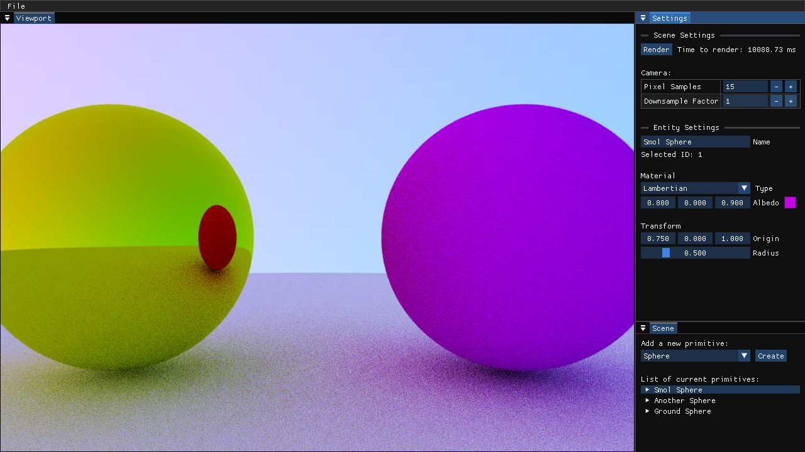

# ray-tracer ⚡

A (work in progress) ray tracer written from scratch in modern C++.



There are three CMake targets: engine (the ray tracing library), viewer (an imgui app to display renders) and cli (a cli tool in the future, a quick debugging tool for now). This work is based on the Ray Tracing in One Weekend book.

## Setup

Clone the repo with the submodules:
```sh
git clone --recursive https://github.com/stefanasandei/ray-tracer.git
```

Or if you forgot `--recursive`, to fetch the git submodules after clone:
```sh
git submodule update --init
```

Afterwards it's the classic CMake setup:
```sh
mkdir build && cd build
cmake ..
```

Now open the project with Visual Studio, CLion or your editor of choice. Use the `cli` or `viewer` targets to get an executable. Output files will be in `./bin/`, alongside the renders (`./bin/sample.png` by default). 

At the moment I am working on the Vulkan rendering backend, to change back to the fully working CPU backend modify the `./include/renderer.hpp` file.

Relevant files are in `./src/cli/main.cpp` (library usage) and in `./include/engine/` + `./src/engine/`.

## License

[MIT](LICENSE) © [Asandei Stefan-Alexandru](https://asandei.com). All rights reserved.
